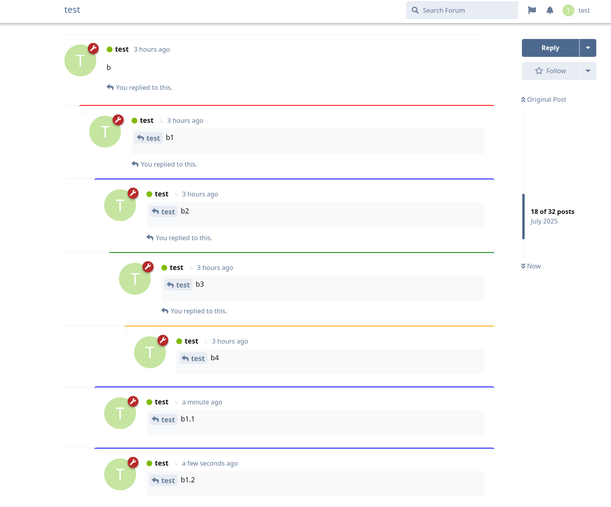

# Threadify for Flarum

[](https://github.com/SyntaxOutlaw/threadify/blob/main/LICENSE)
[](https://packagist.org/packages/syntaxoutlaw/threadify)
[](https://packagist.org/packages/syntaxoutlaw/threadify)
[](https://coff.ee/syntaxoutlaw)


A Flarum extension that adds **threaded discussions** with visual indentation to your forum, making complex conversations easier to follow.

## 🚀 Features

- **Multi-level nested threading** with distinct colors and indentation for each depth
- **Pre-computed thread structure** - efficient backend thread calculation and storage
- **Real-time updates** - new replies appear in correct threaded positions instantly
- **Seamless integration** - uses existing Flarum mentions
- **Works on existing discussions** - will also create threads for past discussions

## 📋 Requirements

- **Flarum** v1.8.10+ (tested on 1.8.10)
- **Flarum Mentions Extension** - Required for threading to work
- **PHP** 7.4+

## 👀 Preview:


## 🔧 Installation

### Via Composer (when published)
```bash
composer require syntaxoutlaw/threadify
```

### Manual Installation
1. Clone/download this repository into your `extensions/threadify/` directory
2. Run `composer install` in the extension directory
3. Run `cd js && npm install && npm run build` to compile JavaScript
4. Enable the extension in your Flarum admin panel

## 🎯 How to Use

Threading works automatically using Flarum's mentions extension:

1. **Click Reply** on any post
2. **Keep the @ mention** that's automatically inserted (e.g., `@"Username"#p123`)
3. **Write your reply** and submit
4. Your reply will appear **indented** under the parent post

## ⚙️ How It Works

### Backend (PHP)
- **Database Structure**: 
  - Adds `parent_id` column to posts table for basic parent-child relationships
  - Creates `threadify_threads` table for advanced thread metadata (depth, path, counts)
- **Thread Processing**: 
  - Listens for new posts and extracts parent relationships from mention format `@"Name"#p123`
  - Pre-computes thread depth, path, and descendant counts for efficient frontend rendering
  - Maintains thread hierarchy with proper indexing for fast queries
- **API Endpoints**:
  - `/discussions/{id}/threads` - Returns complete thread structure with metadata
  - `/threadify/admin/rebuild-parent-ids` - Admin tool for rebuilding thread relationships

### Frontend (JavaScript)
- **Thread Tree Building**: 
  - Uses pre-computed thread metadata from backend API
  - Builds parent-child tree structures and flattens them to linear threaded order
- **Visual Styling**: 
  - Applies CSS classes for visual depth styling (`thread-depth-1`, `thread-depth-2`, etc.)
  - Progressive indentation with color-coded depth indicators


## 🔍 Troubleshooting

- **Threading not working?** Ensure `flarum/mentions` extension is enabled
- **Posts not loading?** Check browser console for errors and run `php flarum cache:clear`
- **Visual issues?** Run `php flarum assets:publish` and clear browser cache
- **Database issues?** Run `php flarum migrate` to ensure all migrations are applied

## 📝 License

MIT License - see [LICENSE](LICENSE) file for details.


**Made with ❤️ for the Flarum community** 
